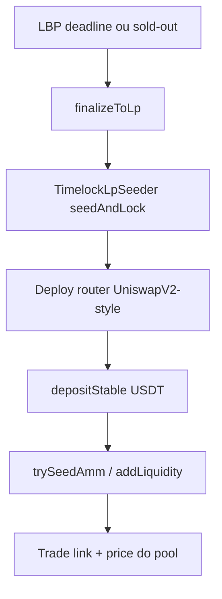

# Fase 3 — Seed AMM pós-LBP (Opção A)

Pré-requisito: LBP aberta e depois **finalizada** (`finalizeToLp` → [`TimelockLpSeeder`](../../contracts/TimelockLpSeeder.sol) escrow).  
GTM: [`FASE2-GTM.md`](./FASE2-GTM.md) · Ops LBP: [`FASE2-OPS.md`](./FASE2-OPS.md).

**Não anunciar pool / Trade até o seed on-chain existir.**

## Porquê um passo separado

O `TimelockLpSeeder` em produção é **escrow-only** (bytecode slim para o teto EAVM).  
`configureAmm` / `trySeedAmm` ficam para um **contrato seguinte** (ou extensão) depois do `seedAndLock`.

## Sequência

1. **Finalize** — keeper permissionless: `PublicVault.finalizeToLp()`  
   Move `lpSeed + (lbpAllocated − lbpSold)` para o seeder com unlock ~18m.
2. **Router** — factory/router mínimo EAV7/USDT (dialeto EVM, Chain ID 72020).  
   Deploy nativo com stake (mesmo teto de energia/calldata).
3. **Stable side** — USDT da private-sale treasury (`contracts/sale/payment-rails.json`).
4. **Seed** — addLiquidity EAV7 (escrow) + USDT; LP tokens locked no timelock.
5. **Front** — link Trade; [`/price`](../../web-next/src/app/price/route.ts) passa a refletir pool; [`/market`](../../web-next/src/app/market/page.tsx) lista endereços.

## Pré-requisitos

| Item | Nota |
|---|---|
| LBP `finalized` | Escrow com `lockedEav7` > 0 |
| USDT inventário | Conta ops + valor alinhado ao LP seed |
| Deployer com energia | Stake híbrido (como no deploy do vault) |
| `ammRouter` / `pairToken` | Só preencher `public-lbp-addresses.json` após deploy real |
| Multisig ops | Preferível antes de `depositStable` grande |

## Checklist ops

- [ ] `finalizeToLp` confirmado (keeper `--live` ou tx pública)
- [ ] Verificar saldo EAV7 no TimelockLpSeeder
- [ ] Deploy router + pair (endereços públicos)
- [ ] `depositStable` (USDT)
- [ ] Seed AMM + LP lock
- [ ] Atualizar `public-lbp-addresses.json` (`ammRouter0x`, `pairToken0x`)
- [ ] Site Trade + `/price` pool
- [ ] Só então: volume → CoinGecko / CMC (Fase tracker do [`PLANO-PUBLICACAO.md`](./PLANO-PUBLICACAO.md))

## Buffer CEX (depois da DEX)

Os 6,75B no PublicVault (bucket buffer) **não** entram no seed AMM.  
Saem só com checklist ops / multisig quando houver deal CEX (ver partição em `public-distribution.json`).

## Não fazer

- Anunciar “Trade live” sem `pair` on-chain
- Submeter CG/CMC sem volume no pool
- Misturar buffer CEX no seed LP
- Reusar chave de âncora no router deploy
